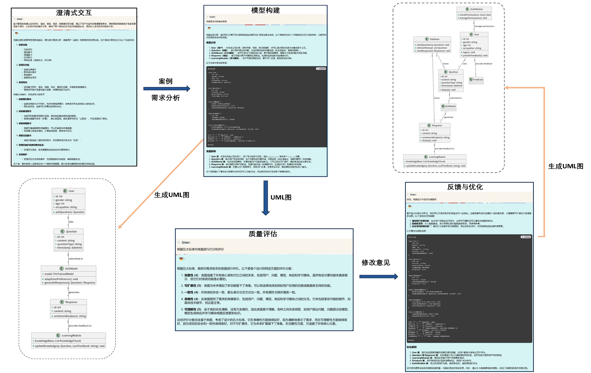

## 摘要

需求建模是软件开发生命周期中的核心阶段，然而，传统UML需求建模往往采用耗时长、易出错的人工方式，且建模人员需具备一定的专业知识，虽然近年来涌现了一些利用大语言模型完成 UML 建模任务的研究，但是它们均为间接生成，存在一定的局限性。为了应对上述挑战，本文提出了一种基于提示和微调大模型的需求建模工具——AUG（Automatic UML Generation），该工具以GLM4-9B-Chat这样一种国产化大模型为开发基座，对其进行提示引导和微调训练，使其具有澄清式交互、需求模型构建和自动评估与反馈等多个核心功能。实验结果表明，在输入相同的需求时，AUG工具在生成UML类图、用例图和时序图方面的综合效果最优。具体而言，AUG在精确度、召回率和F1值分别达到了78.68%、67.37%、72.59%，与需要付费的ChatGPT 4.0（最强基线）相比，准确率虽然略低，但在召回率和F1值方面有较好的优势，综合性能更优。这说明AUG工具在需求自动化建模方面具有较好的应用前景，为该领域提供了一种新的应用范式。模型预训练的权重详见：https://huggingface.co/afedf/AUG；工具使用地址为：http://27.25.158.240:63343/（出于成本考虑，目前每天在北京时间上午的10点到12点开放2小时，供评审使用）；视频地址为：https://space.bilibili.com/2098923360?spm\_id\_from=333.1007.0.0。

## 工具功能

<video controls width="50000">
  <source src="./assets/演示.mp4" type="video/webm" />
</video>



## 使用方法

### 模型部署

可以从我们的huggingface仓库中下载我们的预训练权重模型将他们放入./models文件夹中，我们提供了API部署方式的代码以符合我们项目的需要；如果需要终端交互可以使用官网提供的方法。

```1
cd llm_serve
pip install -r requirements.txt
python api.py
```

### PlantUML服务器部署

```puml
cd puml_serve
java -jar plantuml.jar -picoweb:8888  //更换运行的端口
```

### web部署

我们的前端使用Vue，后端使用Flask快速开发。

#### 前端

```client
cd web_demo/client
npm install
npm run serve
```

如果要修改请求后端的url，修改文件./web_demo/client/vue.config.js 的第六行

```vue.config.js
target: 'http://27.25.158.240:21561', // 你的后端接口地址
//替换为你的后端地址
```

#### 后端

```serve
cd web_demo/server
pip install -r requirements.txt
python app.py
```

如果要修改请求大模型的地址或请求plantUML服务器的地址，修改文件app.py的第17行和第18行。

## 关于我们

<table>
  <tr>
    <td style="width: 30%;">
      
    </td>
    <td style="vertical-align: middle; padding-left: 10px;">
      武汉纺织大学 卢佳<br>
      Email: <a href="mailto:2204240222@mail.wtu.edu.cn">2204240222@mail.wtu.edu.cn</a>
    </td>
  </tr>
</table>
<table>
  <tr>
    <td style="width: 30%;">
      
    </td>
    <td style="vertical-align: middle; padding-left: 10px;">
      武汉纺织大学 孙培伶<br>
      Email: <a href="mailto:2204240513@mail.wtu.edu.cn">2204240513@mail.wtu.edu.cn</a>
    </td>
  </tr>
</table>
<table>
  <tr>
    <td style="width: 30%;">
      
    </td>
    <td style="vertical-align: middle; padding-left: 10px;">
      武汉纺织大学 李思雨<br>
      Email: <a href="mailto:2204240106@mail.wtu.edu.cn">2204240106@mail.wtu.edu.cn</a>
    </td>
  </tr>
</table>
<table>
  <tr>
    <td style="width: 30%;">
      
    </td>
    <td style="vertical-align: middle; padding-left: 10px;">
      武汉纺织大学 朱诗雨<br>
      Email: <a href="mailto:1303334710@qq.com">1303334710@qq.com</a>
    </td>
  </tr>
</table>
<table>
  <tr>
    <td style="width: 30%;">
      
    </td>
    <td style="vertical-align: middle; padding-left: 10px;">
      武汉纺织大学 袁瑛凯<br>
      Email: <a href="mailto:3403613474@qq.com">3403613474@qq.com</a>
    </td>
  </tr>
</table>
<table>
  <tr>
    <td style="width: 30%;">
      
    </td>
    <td style="vertical-align: middle; padding-left: 10px;">
      武汉纺织大学 陈億<br>
      Email: <a href="mailto:3458981693@qq.com">3458981693@qq.com</a>
    </td>
  </tr>
</table>

## Star History

[](https://star-history.com/#XIAOLingQ/AUG&Date)
